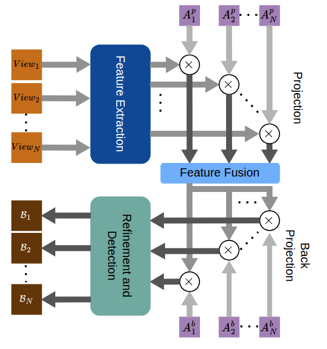

# CaMuViD: Calibration-Free Multi-View Detection

The official implementation of [CaMuViD: Calibration-Free Multi-View Detection](https://amiretefaghi.github.io/Camuvid.html).

## Introduction

CaMuViD is an advanced multi-view pedestrian detection model developed by researchers from AI Laboratory, University of Florida. The backbone of this model is based on [InternImage](https://github.com/OpenGVLab/InternImage), InternImage employs DCNv3 as its core operator. This approach equips the model with dynamic and effective projection and back projection estimation networks to transform from image space feature maps to shared space feature maps for multi-views.

<div align=center>

</div>


## 🌟 Performance Highlights

- **State-of-the-Art Multi-View Detection**  
  On **Wildtrack** we achieve **95.0 % MODA** (+0.9 pp over prior best) and **80.9 % MODP**, with **96.3 % precision**, **98.6 % recall**, and **97.4 % F₁**.  
  On **MultiviewX** we reach **96.5 % MODA**, **89.3 % MODP**, **97.9 % precision**, **98.6 % recall**, and **98.3 % F₁**—all best-in-class.  

- **Exceptional Cross-Dataset Generalization**  
  Trained on MultiviewX and tested on Wildtrack, our model still delivers **86.4 % MODA**, **60.7 % MODP**, **89.3 % precision**, **98.1 % recall**, and **93.5 % F₁**, outperforming prior methods by > 9 pp in F₁.  

- **Ablation: The Power of Multiple Views**  
  Removing views drops performance dramatically—single-camera yields only **60.1 % MODA** and **65.0 % MODP**.  
  By integrating **five cameras**, we recover to **95.6 % MODA**, **80.2 % MODP**, **96.6 % precision**, **99.3 % recall**, and **98.0 % F₁**, underscoring the **indispensable value of comprehensive multi-view coverage**.


**Multi-View Detection Results**

| Method                   | WT MODA ↑ | WT MODP ↑ | WT Prec. ↑ | WT Rec. ↑ | WT F1 ↑ | MVX MODA ↑ | MVX MODP ↑ | MVX Prec. ↑ | MVX Rec. ↑ | MVX F1 ↑ |
|--------------------------|:---------:|:---------:|:----------:|:---------:|:-------:|:----------:|:----------:|:-----------:|:---------:|:--------:|
| RCNN & clustering        |   11.3    |   18.4    |   68.0     |   43.0    |  52.7   |   18.7*    |   46.4*    |    63.5*    |   43.9*   |  51.9    |
| POM-CNN                  |   23.2    |   30.5    |   75.0     |   55.0    |  63.5   |     –      |     –      |      –      |     –     |    –     |
| DeepMCD                  |   67.8    |   64.2    |   85.0     |   82.0    |  83.5   |   70.0*    |   73.0*    |    85.7*    |   83.3*   |  84.5    |
| Deep-Occlusion           |   74.1    |   53.8    |   95.0     |   80.0    |  86.8   |   75.2*    |   54.7*    |    97.8*    |   80.2*   |  88.1    |
| MVDet                    |   88.2    |   75.7    |   94.7     |   93.6    |  94.1   |   83.9     |   79.6     |    96.8     |   86.7    |  91.5    |
| SHOT                     |   90.2    |   76.5    |   96.1     |   94.0    |  95.0   |   88.3     |   82.0     |    96.6     |   91.5    |  94.0    |
| MVDeTr                   |   91.5    |   82.1    |   97.4     |   94.0    |  95.7   |   93.7     |   91.3     |    99.5     |   94.5    |  96.9    |
| MVAug                    |   93.2    |   79.8    |   96.3     |   97.0    |  96.6   |   95.3     |   89.7     |    99.4     |   95.9    |  97.6    |
| 3DROM                    |   93.5    |   75.9    |   97.2     |   96.2    |  96.7   |   95.0     |   84.9     |    99.0     |   96.1    |  97.5    |
| MVFP                     |   94.1    |   78.8    |   96.4     |   97.7    |  97.0   |   95.7     |   82.1     |    98.4     |   97.2    |  97.8    |
| TrackTacular             |   93.2    |   77.5    |   97.3     |   95.8    |  96.5   |   96.5     |   75.0     |    99.4     |   97.1    |  98.2    |
| **Ours**                 | **95.0**  | **80.9**  | **96.3**   | **98.6**  |**97.4** | **96.5**   | **89.3**   | **97.9**    | **98.6**  |**98.3**  |

\* reported by original authors

---

**Cross-Dataset Performance**

| Method         | MODA | MODP  | Prec. | Recall | F1   |
|----------------|:----:|:-----:|:-----:|:------:|:----:|
| MVDet [17]     | 17.0 | 65.8  | 60.5  | 48.8   | 54.0 |
| MVAug [10]     | 26.3 | 58.0  | 71.9  | 50.8   | 59.5 |
| MVDeTr [16]    | 50.2 | 69.1  | 74.0  | 77.3   | 75.6 |
| SHOT [34]      | 53.6 | 72.0  | 75.2  | 79.8   | 77.4 |
| GMVD [39]      | 66.1 | 72.2  | 82.0  | 84.7   | 83.3 |
| 3DROM [30]     | 67.5 | 65.6  | 94.5  | 71.7   | 81.5 |
| MVFP [1]       | 76.7 | 74.9  | 85.2  | 92.8   | 88.8 |
| **Ours**       |**86.4**|**60.7**|**89.3**|**98.1**|**93.5**|

---

**Camera-Elimination Ablation**

| C1 | C2 | C3 | C4 | C5 | C6 | C7 | MODA  | MODP | Precision | Recall |  F1  |
|:--:|:--:|:--:|:--:|:--:|:--:|:--:|:-----:|:----:|:---------:|:------:|:----:|
| ✓  | ✗  | ✗  | ✗  | ✗  | ✗  | ✗  | 60.1  | 65.0 |   99.8    | 60.2   | 75.1 |
| ✓  | ✓  | ✗  | ✗  | ✗  | ✗  | ✗  | 77.8  | 71.5 |   99.8    | 77.9   | 87.5 |
| ✓  | ✓  | ✓  | ✗  | ✗  | ✗  | ✗  | 90.6  | 76.4 |   98.4    | 92.1   | 95.1 |
| ✓  | ✓  | ✓  | ✓  | ✗  | ✗  | ✗  | 93.8  | 79.4 |   98.3    | 95.5   | 96.9 |
| ✓  | ✓  | ✓  | ✓  | ✓  | ✗  | ✗  | 93.8  | 80.0 |   96.8    | 96.9   | 97.0 |
| ✓  | ✓  | ✓  | ✓  | ✓  | ✓  | ✗  | **95.6** | 80.2 |   96.6    | 99.3   | 98.0 |
| ✓  | ✓  | ✓  | ✓  | ✓  | ✓  | ✓  | 95.0  | 80.9 |   96.3    | 98.6   | 97.4 |


Our detection code is developed on top of [MMDetection v2.28.1](https://github.com/open-mmlab/mmdetection/tree/v2.28.1).

<!-- TOC -->

- [Installation](#installation)
- [Data Preparation](#data-preparation)
- [Evaluation](#evaluation)
- [Training](#training)

<!-- TOC -->

## Installation

- Clone this repository:

```bash
git clone https://github.com/amiretefaghi/CaMuViD.git
cd CaMuViD
```

- Create a conda virtual environment and activate it:

```bash
conda create -n camuvid python=3.9
conda activate camuvid
```

- Install `CUDA>=10.2` with `cudnn>=7` following
  the [official installation instructions](https://docs.nvidia.com/cuda/cuda-installation-guide-linux/index.html)
- Install `PyTorch>=1.10.0` and `torchvision>=0.9.0` with `CUDA>=10.2`:

For examples, to install `torch==1.11` with `CUDA==11.3`:

```bash
pip install torch==1.11.0+cu113 torchvision==0.12.0+cu113  -f https://download.pytorch.org/whl/torch_stable.html
```

- Install other requirements:

  note: conda opencv will break torchvision as not to support GPU, so we need to install opencv using pip.

```bash
conda install -c conda-forge termcolor yacs pyyaml scipy pip -y
pip install opencv-python
```

- Install `timm`, `mmcv-full` and \`mmsegmentation':

```bash
pip install -U openmim
mim install mmcv-full==1.5.0
mim install mmsegmentation==0.27.0
pip install timm==0.6.11 mmdet==2.28.1
```

- Install other requirements:

```bash
pip install opencv-python termcolor yacs pyyaml scipy
# Please use a version of numpy lower than 2.0
pip install numpy==1.26.4
pip install pydantic==1.10.13
pip install yapf==0.40.1
```

- Compile CUDA operators

Before compiling, please use the `nvcc -V` command to check whether your `nvcc` version matches the CUDA version of PyTorch.

```bash
cd ./ops_dcnv3
sh ./make.sh
# unit test (should see all checking is True)
python test.py
```

- You can also install the operator using precompiled `.whl` files
  [DCNv3-1.0-whl](https://github.com/OpenGVLab/InternImage/releases/tag/whl_files)

## Data Preparation

Prepare datasets according to the guidelines in [MMDetection v2.28.1](https://github.com/open-mmlab/mmdetection/blob/master/docs/en/1_exist_data_model.md).


## Evaluation

To evaluate our model on desired dataset, set mode to test in the Config.py file, run:

```
python camuvid.py
```

## Training

To finetune an `InternImage` backbone on desired dataset, run:

```
python train.py ./configs/{dataset_name}/mask_rcnn_internimage_b_fpn_3x_coco.py  --load-from ./models/coco_pretrained/mask_rcnn_internimage_b_fpn_3x_coco.pth
```
and then train the detection section, you should modify the Config.py file. You should set the mode to train and write the address of train and test annotations directory, then run:

```
python camuvid.py
```

## Citation

If this work is helpful for your research, please consider citing the following BibTeX entry.

```bibtex
@InProceedings{etefaghi2025camuvid,
                            author    = {Daryani, Amir Etefaghi and Bhutta, M. Usman Maqbool and Hernandez, Byron and Medeiros, Henry},
                            title     = {CaMuViD: Calibration-Free Multi-View Detection},
                            booktitle = {Proceedings of the Computer Vision and Pattern Recognition Conference (CVPR)},
                            month     = {June},
                            year      = {2025},
                            pages     = {1220-1229}
                        }
```
